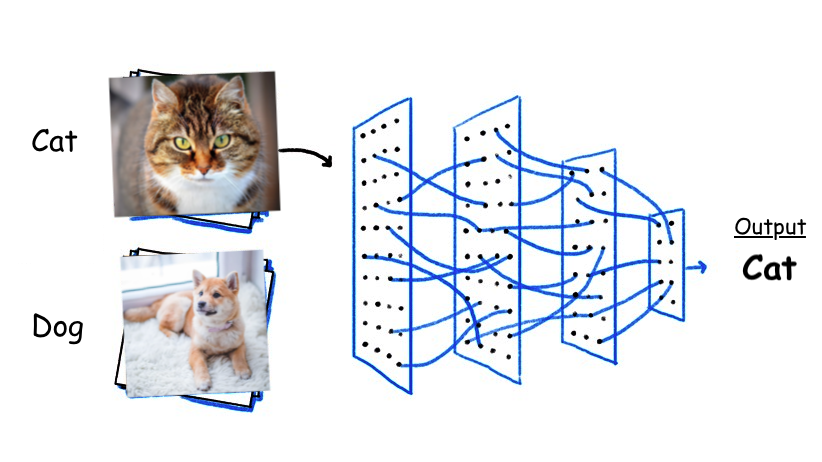
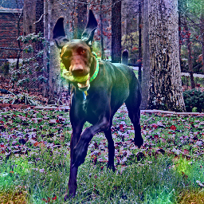
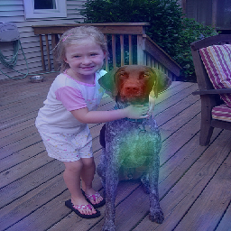
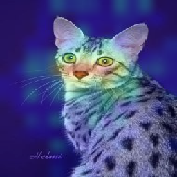
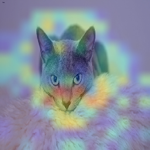

# Desafio Prático de Machine Learning
***
- [Instituto Centro de Tecnologia e Software](www.icts.org.br)

### Motivação
***
Problemas de classificação são uma aplicação bastante comum de algoritmos de aprendizagem de máquina, onde Redes Neurais tendem a se destacar sobretudo quando são utilizados dados não estruturados. Nesse tipo de problema, os exemplos são divididos em classes e cada classe é associada a um número inteiro. Nesse contexto, a função do classificador é associar cada exemplo de entrada à sua respectiva classe. Algumas tarefas de classificação são a identificação da presença de pessoas em uma imagem, a presença de anomalias em exames médicos ou ainda a identificação de componentes com defeito na linha de produção.

### Objetivo
***
Nessa tarefa, espera-se a concepção de um modelo de Aprendizagem de Máquina capaz de classificar uma dada imagem quanto à presença de cães ou gatos. Para isso, será utilizado o banco de dados [Cats and Dogs Breeds Classification Oxford Dataset](https://www.kaggle.com/zippyz/cats-and-dogs-breeds-classification-oxford-dataset), que contém mais de 7 mil imagens de cães e gatos de raças diversas. Nesse banco de dados, as imagens de gatos têm seu nome iniciado com letra maiúscula (i.e. **Abyssinian_34.jpg**) e as imagens de cães têm o nome iniciado com letra minúscula (i.e. **beagle_1.jpg**). O banco de dados pode ser acessado a partir da plataforma Kaggle a partir do link acima.

### Alguma dúvida? Entre em contato comigo: 
***
> - [Me envie um e-mail](mailto:alysson.barbosa@ee.ufcg.edu.br)

### Análise Esperada

|||
|-|-|
|||
|||
> Imagens obtidas utilizando o algoritmo Grad CAM.